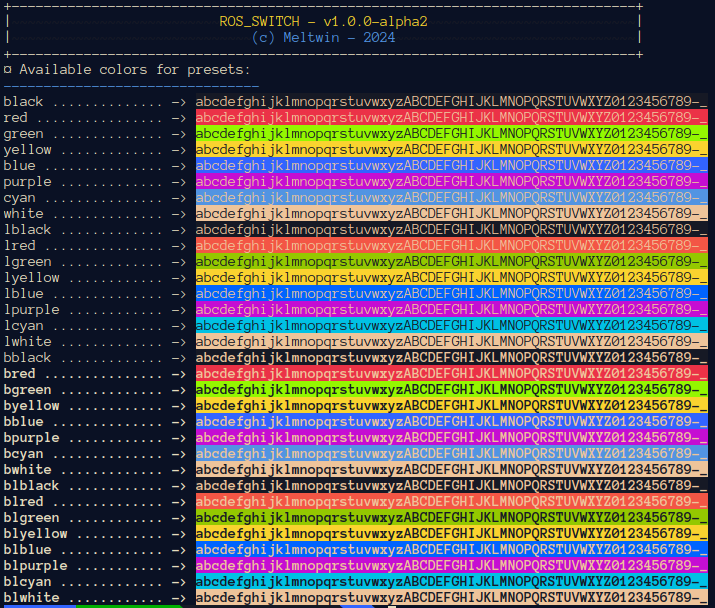

# YAML Reference

This application uses YAML files to describe the ROS profiles. This page contains the documentation on how to fill it to match your needs.

## Complete YAML file

The block below shows the complete YAML file with all possibilities:

```yaml
preset:
    ros_version: # mandatory <int, choices=[1,2]>
    metadata:
        author: "" # <str>
        description: "" # <str>
        date:   "" # <str>
    term:
        preset_color: "bred" # <str> 
    workspaces: # list of workspace path
        - "<your workspace 1>"
        - "<your workspace 2>"
    env_var:
        "CUSTOM_VAR": 1
        "CUSTOM_VAR2": "hello"
    ros:
        localhost: None # <bool | None>
        ros_root:  None # <str | None>
        log_dir:   None # <str | None>
        ros_master_uri: None # <str | None>
        ros_hostname: None # <str | None>
        ros_ip: None # <str | None>
        domain_id: None # <int | None>
        colorized: None # <bool | None>
        output_format: None # <str | None>
        use_stdout: None # <bool | None>
        buffered: None # <bool | None>
    paths:
        library: # <List[str]>
            - "$HOME/path1"
        cmake: # <List[str]>
            - "$HOME/path1"
        python: # <List[str]>
            - "$HOME/path1"
        path: # <List[str]>
            - "$HOME/path1"
        others: # <Dict[str, List[str]]>
            custom_env:
                - "$HOME/path1"
    pre_load: # <List[str]>
        - "my_cmd 1"
        - "my_cmd 2
    post_load: # <List[str]>
        - "my_cmd 1"
    pre_unload: # <List[str]>
        - "my_cmd 1"
    post_unload: # <List[str]>
        - "my_cmd 1"
```

## Field `ros_version`

**Type**: `mandatory <int> (choices=[1,2])`

This field is to declare whether you will be loading a ROS1 environment or a ROS2 environment. When choosing ROS1, the `$ROS_IP` environment variable will always be set.

## Block `metadata`

**Type**: `optional`

This block is optional as it is only for declaring the author of the preset and its date (for versionning for example).

The fields in this block are:

- `author` (`optional <str>`) a string containing the author name
- `description` (`optional <str>`): the description of this preset
- `date` (`optional <str>`): the date of the modification of the preset

## Block `term`

**Type**: `optional`

This block is to configure the terminal settings of the application.

The fields in this block are:

- `preset_color` (`optional <str>`): the color scheme to use for this preset in the PS1 field. The list of colors can be visualized with the command `rosswitch tools colors`. But here's a list of what color are available:

| Normal color | Light color | Bold color | Light Bold color |
| :----------: | :---------: | :--------: | :--------------: |
|    black     |   lblack    |   bblack   |     blblack      |
|     red      |    lred     |    bred    |      blred       |
|    green     |   lgreen    |   bgreen   |     blgreen      |
|    yellow    |   lyellow   |  byellow   |     blyellow     |
|     blue     |    lblue    |   bblue    |      blblue      |
|    purple    |   lpurple   |  bpurple   |     blpurple     |
|     cyan     |    lcyan    |   bcyan    |      blcyan      |
|    white     |   lwhite    |   bwhite   |     blwhite      |

<figure markdown="span">
  
  <figcaption>Custom PS1 for displaying current loaded profile</figcaption>
</figure>

<figure markdown="span">
  
  <figcaption>Output of the command to get the possible preset colors</figcaption>
</figure>

## Field `workspaces`

**Type**: `optional <List[str]>`

This field should contains the list of the paths of the several ROS workspaces that you want to load with this preset.

## Field `env_var`

**Type**: `optional <Dict[str, Any]>`

This field should contain a mapping between environment variable names, and the value that should be assigned to it.

## Block `ros`

**Type**: `optional`

This block contains the configuration of the ROS environment through its custom environment variables. You can find most of them on the ROS1 and ROS2 online documentation.

The fields in this block are:

- `localhost` (`optional <bool>`): define whether you want to use ROS on your machine only or in you network. <br> Correspond to `ROS_LOCALHOST_ONLY` env var. <br> See [ROS2 documentation - Localhost](https://docs.ros.org/en/rolling/Tutorials/Beginner-CLI-Tools/Configuring-ROS2-Environment.html#the-ros-localhost-only-variable) for this
- `ros_root` (`optional <str>`): define where your ROS root should be (i.e. the location of the ROS core package). <br>Correspond to `ROS_ROOT` env var. <br>See [ROS1 Documentation](https://wiki.ros.org/ROS/EnvironmentVariables) for more information.
- `log_dir` (`optional <str>`): define where the logs directory is located.<br> Correspond to `ROS_LOG_DIR` env var.<br> See [ROS 1 documentation](https://wiki.ros.org/ROS/EnvironmentVariables) or [ROS 2 documentation - Logging](https://docs.ros.org/en/rolling/Concepts/Intermediate/About-Logging.html#environment-variables)
- `ros_master_uri` (`optional <str>`): define what the ROS Master URI is.<br> Correspond to `ROS_MASTER_URI` env var. <br> See [ROS 1 documentation](https://wiki.ros.org/ROS/EnvironmentVariables)
- `ros_hostname` (`optional <str>`): define the hostname of the running nodes in this terminal.<br> Correspond to `ROS_HOSTNAME` env var. <br> See [ROS 1 documentation](https://wiki.ros.org/ROS/EnvironmentVariables)
- `ros_ip` (`optional <str>`): define the IP of the running nodes in this terminal.<br>Correspond to `ROS_IP` env var. <br> See [ROS 1 documentation](https://wiki.ros.org/ROS/EnvironmentVariables) <br> This field can be filled in two several ways:
    - using an IPv4 address (as per defined by the ROS documentation). For example, you could write `ros_ip: 192.168.1.15`
    - specifying an interface name (added by this application). You can type part or the entire interface name so that the script will find the first interface with a similar name. For example if you have the interfaces (`lo`, `wlp0s20f3`) you could write any of the configuration below and it will choose the second interface. The IP is computed as runtime, so you do not need to build the profile each time you change network: you only have to reload the preset.
        - `ros_ip: w`
        - `ros_ip: wlp`
        - `ros_ip: wlp0s20f3`
- `domain_id` (`optional <int>`): set up the id in the DDS domain of you computer.<br>Correspond to `ROS_DOMAIN_ID` env var. <br> See [ROS 2 documentation - Domain ID](https://docs.ros.org/en/rolling/Concepts/Intermediate/About-Domain-ID.html)
- `colorized` (`optional <bool>`): define if the output of the ROS logs be colorized in the terminal.<br> Correspond to `RCUTILS_COLORIZED_OUTPUT` env var.<br> See [ROS 2 documentation - Logging](https://docs.ros.org/en/rolling/Concepts/Intermediate/About-Logging.html#environment-variables)
- `output_format` (`optional <str>`): define how the ROS logging format should be.<br> Correspond to `RCUTILS_CONSOLE_OUTPUT_FORMAT` env var.<br> See [ROS 2 documentation - Logging](https://docs.ros.org/en/rolling/Concepts/Intermediate/About-Logging.html#environment-variables)
- `use_stdout` (`optional <bool>`): define whether the logging output should go to stdout (1) or stderr (0).<br> Correspond to `RCUTILS_LOGGING_USE_STDOUT` env var.<br> See [ROS 2 documentation - Logging](https://docs.ros.org/en/rolling/Concepts/Intermediate/About-Logging.html#environment-variables)
- `buffered` (`optional <bool>`): define whether the logging output should be in buffered (1) or unbuffured mode (0).<br> Correspond to `RCUTILS_LOGGING_BUFFERED_STREAM` env var.<br> See [ROS 2 documentation - Logging](https://docs.ros.org/en/rolling/Concepts/Intermediate/About-Logging.html#environment-variables)

## Block paths

**Type**: `optional`

This block let you customize environment variable paths with automatization on cleaning.

The fields in this block is:

- `library` (`optional <List[str]>`): add all elements of this list to the `LD_LIBRARY_PATH` environment variable.
- `python` (`optional <List[str]>`): add all elements of this list to the `PYTHONPATH` environment variable.
- `cmake` (`optional <List[str]>`): add all elements of this list to the `CMAKE_PREFIX_PATH` environment variable.
- `path` (`optional <List[str]>`): add all elements of this list to the `PATH` environment variable.
- `others` (`optional <Dict[str, List[str]]>`): define path list environment variable as the key, and the list as element to add to this one.

## Fields `pre_load`, `post_load`, `pre_unload` and `post_unload`
    
**Type**: `optional <List[str]>`

These four fields should contain the commands that should be runned before and after the loading and unloading of the environment. This is mainly for allowing you to do anything that is not possible with the other YAML configurations.
